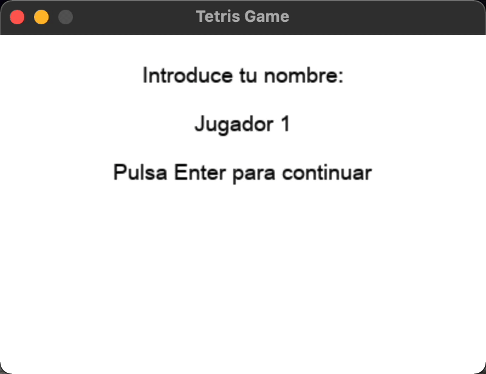

# SDL2_Tetris

Simple tetris game using [sdl2](https://www.libsdl.org/index.php) libraries



## Structure

1. game_Init:

- It is responsible for rendering the initial screen of the game.
- It asks for the user's name and stores it.

2. game:

- Contains the tetris operation algorithm in the `game_run()` function. Furthermore, this function is the one that contains the main loop of the program.

- It represents graphically all the pieces, board and information of the state of the game.

- It contains an interruption function in charge of indicating when the piece must go down.

- Manage the state of the game by storing the pieces and occupied board positions in a boolean table.

4. pieza:

- Contains information about the tetris pieces.
- Contains a random generator of parts and colors.
- Contains functions responsible for turning the pieces

5. tablero:

It's in charge of managing a boolean table with information about the board (elimination of complete rows, compacting the board, checking if a piece can be moved ...)

6. texto

Class with functions for rendering text and managing rendered textures of text.

## Compatibility

It has been tested on Linux, Windows and Mac OS (including the new M1)

## Dependencies for Running Locally

### cmake >= 3.7

All OSes: click [here](https://cmake.org/install/) for installation instructions

### __make >= 4.1 (Linux), 3.81 (Mac and Windows)__

- Linux: make is installed by default on most Linux distros
- Mac: install Xcode command line tools to get make
- Windows: install MingGW (including mingw32-make). I recommend to simply download and decompress the collection of tools [Winlibs](http://winlibs.com)

### __SDL2 >= 2.0__

A very good installations instructions can be found on [Lazyfoo](https://lazyfoo.net/tutorials/SDL/01_hello_SDL/index.php)

__Development Libraries requiered:__

1. SDL: https://www.libsdl.org/download-2.0.php
2. SDL_ttf: https://www.libsdl.org/projects/SDL_ttf/

__Note for Linux__ an apt or apt-get installation is preferred to building from source.

__Note for Windows 1__: you have to adapt the sdl2-config.cmake with your SDL2 folder localization. For example:

```bash
set(prefix "C:/mingw_dev_lib")
set(SDL2_PREFIX "C:/sdl2_dev_lib")
set(SDL2_EXEC_PREFIX "C:/sdl2_dev_lib")
...
```

__Note for Windows 2:__ to avoid problems in windows, use the 32bits version of the libraries.

### __gcc/g++ >= 5.4__

- Linux: gcc / g++ is installed by default on most Linux distros
- Mac: same deal as make - install Xcode command line tools
- Windows: recommend using MinGW. Included in  [Winlibs](http://winlibs.com)

## Basic Build Instructions in Linux and Mac OS (using command tools)

1. Clone this repo: `git clone ...`.
2. Make a build directory in the top level directory: `mkdir build && cd build`
3. Compile: `cmake .. && make`
4. Run it: `./Tetris`.

## Basic Build Instrutions in Windows using MinGW

1. Clone this repo: `git clone ...`
2. Run cmake: `cmake -B build -G "MinGW Makefiles"`
3. Go into build direcctory: `cd build`
4. Run make (MinGW): `mingw32-make`
5. Run it: `./Tetris.exe`.

__Note:__ To make this commands works in terminal it will be need to add the folder of the tools to a system (or user) PATH.

## Basic Build Instructions in Xcode

To configure the project correctly I recommend to use the instruction of [Lazyfoo](https://lazyfoo.net/tutorials/SDL/01_hello_SDL/mac/xcode/index.php)

If you are using a new M1 processor, make sure that you are executting Xcode under Rosetta 2. The SDL2 library doesn't works for M1 processor, unless you use that tool.

## Rubric Points

### README (All Rubric Points REQUIRED)

- [X] A README with instructions is included with the project
  - The README is included with the project and has instructions for building/running the project.
  - If any additional libraries are needed to run the project, these are indicated with cross-platform installation instructions.
  - You can submit your writeup as markdown or pdf.

- [X] The README indicates which project is chosen.
  - [X] The README describes the project you have built.
  - [X] The README also indicates the file and class structure, along with the expected behavior or output of the program.

- [X] The README includes information about each rubric point addressed.
  - The README indicates which rubric points are addressed.
  - The README also indicates where in the code (i.e. files and line numbers) that the rubric points are addressed.

### Compiling and Testing (All Rubric Points REQUIRED)

- [X] The submission must compile and run.
  - [X] The project code must compile and run without errors.
  - [X] We strongly recommend using `cmake` and `make`, as provided in the starter repos. If you choose another build system, the code must compile on any reviewer platform.

### Loops, Functions, I/O

- [X] The project demonstrates an understanding of C++ functions and control structures.
  - A variety of control structures are used in the project.
  - The project code is clearly organized into functions.

- [X] The project reads data from a file and process the data, or the program writes data to a file.
  - The project reads data from an external file or writes data to a file as part of the necessary operation of the program.

  In `game_close.cpp`, line 91: `Game_Close::registar_puntuacion()`.
  
- [X] The project accepts user input and processes the input: In function gamepantalla_pedir_nombre
  - [X] The project accepts input from a user as part of the necessary operation of the program. In `game_init.cpp`, line 65: `Game_Init::pantalla_pedir_nombre()`.

### Object Oriented Programming

- [X] The project uses Object Oriented Programming techniques. The project code is organized into classes with class attributes to hold the data, and class methods to perform tasks.

- [X] Classes use appropriate access specifiers for class members. All class data members are explicitly specified as public, protected, or private.

- [X] Class constructors utilize member initialization lists. All class members that are set to argument values are initialized through member initialization lists.

- [X] Classes abstract implementation details from their interfaces. All class member functions document their effects, either through function names, comments, or formal documentation. Member functions do not change program state in undocumented ways.

- [X] Classes encapsulate behavior. Appropriate data and functions are grouped into classes. Member data that is subject to an invariant is hidden from the user. State is accessed via member functions.

- [ ] Classes follow an appropriate inheritance hierarchy. Inheritance hierarchies are logical. Composition is used instead of inheritance when appropriate. Abstract classes are composed of pure virtual functions. Override functions are specified.

  - Inheritance not used

- [X] Overloaded functions allow the same function to operate on different parameters. One function is overloaded with different signatures for the same function name.

  - For example, in `texto.h`, there are three overloaded Constructors:

```cpp
Texto();
Texto(std::shared_ptr<SDL_Renderer> ext_render);
Texto(std::string texto_renderizar, std::shared_ptr<SDL_Renderer> ext_render);
```

- [ ] Derived class functions override virtual base class functions. One member function in an inherited class overrides a virtual base class member function.

- [X] Templates generalize functions in the project. One function is declared with a template that allows it to accept a generic parameter:
  - `template <class T> void Texto::renderizar(const T &x, const T &y)` in `texto.h` (line 18).

### Memory Management

- [X] The project makes use of references in function declarations: At least two variables are defined as references, or two functions use pass-by-reference in the project code.

  - For example, several functions included in the game class (see `game.h` and `game.cpp`) use variables passed by reference

- [X] The project uses destructors appropriately: At least one class that uses unmanaged dynamically allocated memory, along with any class that otherwise needs to modify state upon the termination of an object, uses a destructor.

  - Destructors have been created in almost classes to perform the debugging of the program, but in normal operation they are not necessary, because smart pointers are used (some of them even with custom deleters).

  - The destructor of `Game_Close` (`game_close.h`) calls the function `_cerrar()` which liberates the memory allocated by some SDL component in `Game_Init`(`game_init.h`), function `inicialiar()`, called by the constructor of the class.

- [X] The project uses scope / Resource Acquisition Is Initialization (RAII) where appropriate: The project follows the Resource Acquisition Is Initialization pattern where appropriate, by allocating objects at compile-time, initializing objects when they are declared, and utilizing scope to ensure their automatic destruction.

- [X] The project follows the Rule of 5: For all classes, if any one of the copy constructor, copy assignment operator, move constructor, move assignment operator, and destructor are defined, then all of these functions are defined.

  - Classes `tablero.h` and `texto.h` implements rule of five.

- [X] The project uses move semantics to move data, instead of copying it, where possible: For classes with move constructors, the project returns objects of that class by value, and relies on the move constructor, instead of copying the object.

  - For example, in get_* functions from class game, like: `Game::get_nombre_jugador()`, `get_Texto_Puntuacion()`... On line 345 of `game.cpp` and ahead.

- [X] The project uses smart pointers instead of raw pointers: The project uses at least one smart pointer: `unique_ptr`, `shared_ptr`, or `weak_ptr`. The project does not use raw pointers.

  - The project don't use raw pointer. I tried to use smart pointers where it's possible.

### Concurrency

- [X] The project uses multithreading. The project uses multiple threads in the execution.
  - Used in `Game` constructor (line 14 of `game.cpp`)

- [X] A promise and future is used in the project. A promise and future is used to pass data from a worker thread to a parent thread in the project code.
  - Used in `Game_Init` constructor (line 13 of `game_init.cpp`)

- [X] A mutex or lock is used in the project. A mutex or lock (e.g. `std::lock_guard` or `std::unique_lock`) is used to protect data that is shared across multiple threads in the project code.
  - Used in line 28 of `texto.cpp`, function `init_full(...)`.

- [ ] A condition variable is used in the project. A `std::condition_variable` is used in the project code to synchronize thread execution.
